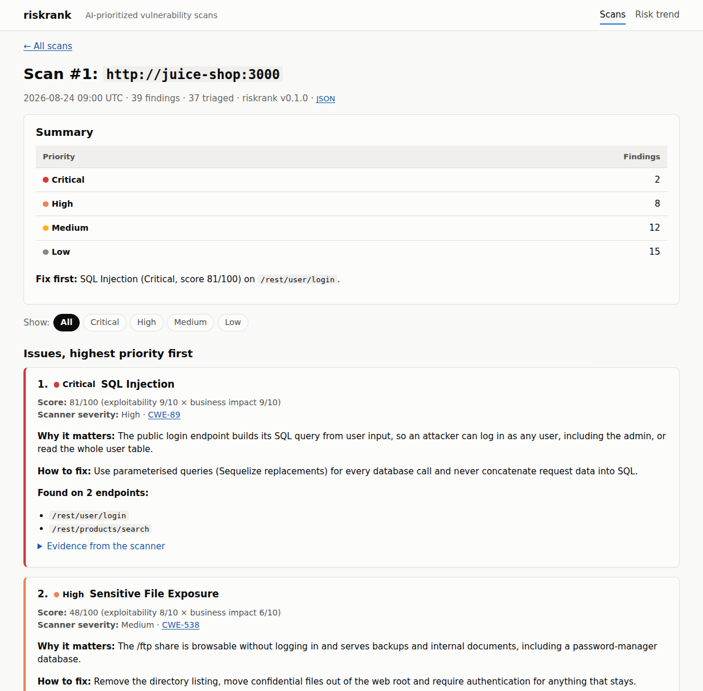
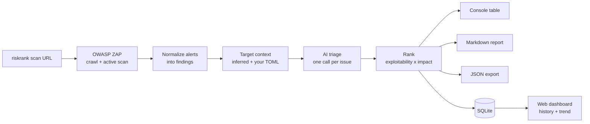
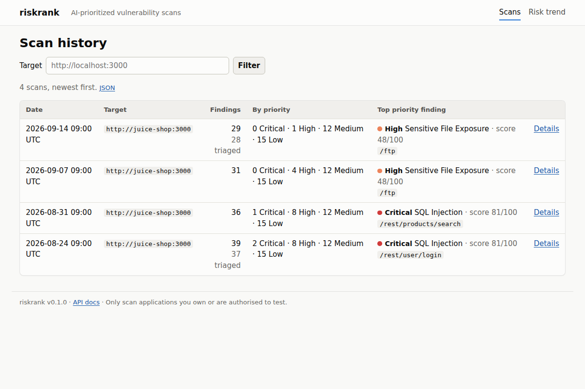
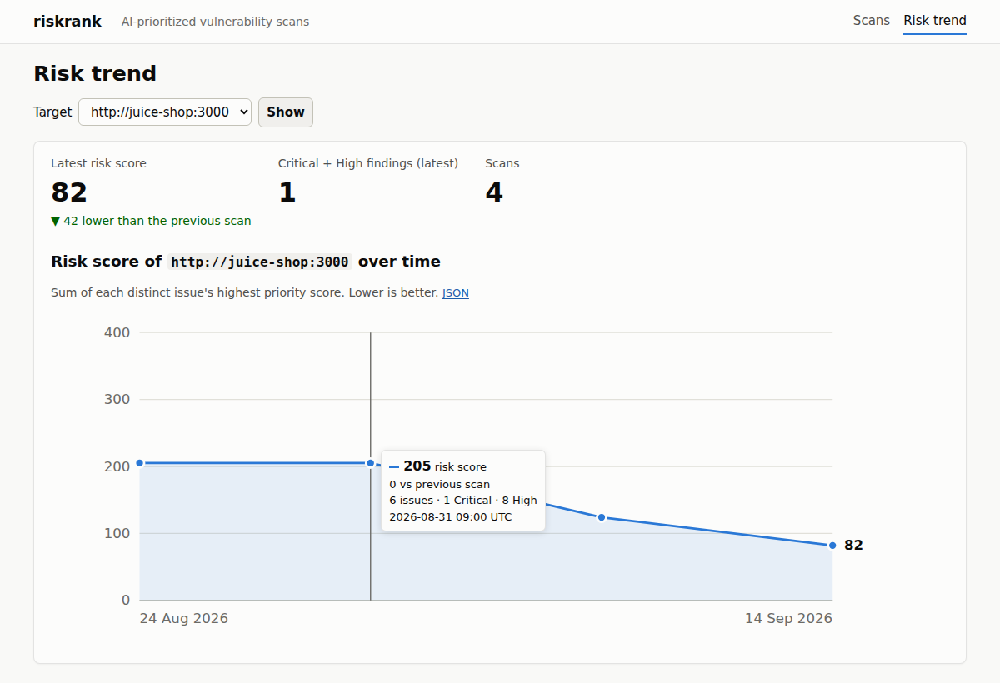
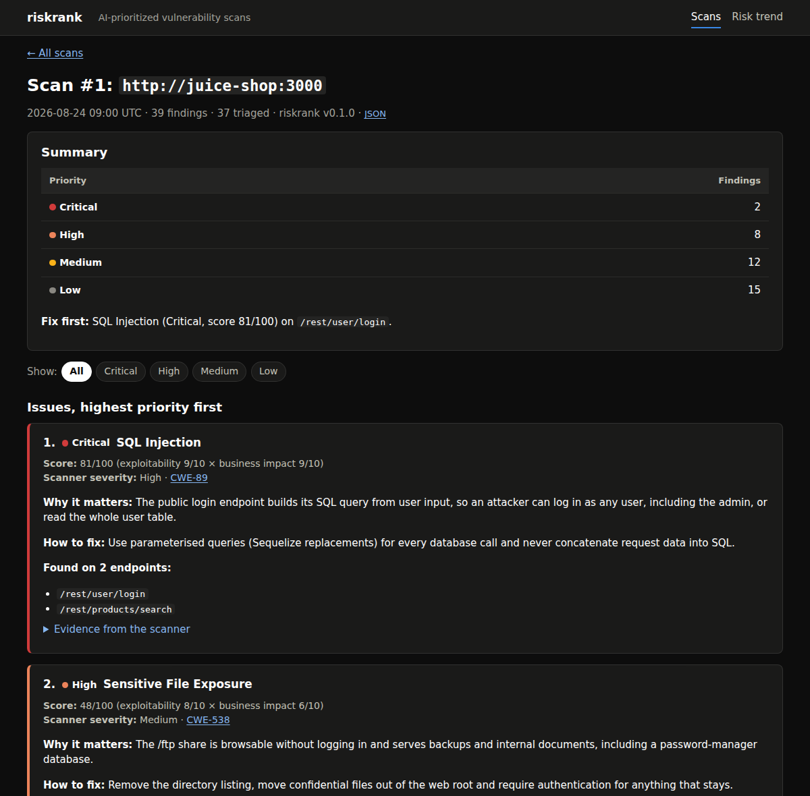

# riskrank

[](https://github.com/Kamogelo-Skhosana/riskrank/actions/workflows/ci.yml)

**AI-powered vulnerability scanner and prioritizer.** riskrank wraps an established security scanner (OWASP ZAP), then uses an LLM to triage the raw findings by real-world exploitability and business impact — turning a wall of low-value alerts into a short, prioritized "fix this first" list.

> b62e53638bc19fd64f593bccb88c2b06Cybersecurity Testing track.



---

## Why riskrank

Raw vulnerability scanner output is famously noisy. A scan of OWASP Juice Shop produced **283 findings — but only 5 distinct issues**, most of them missing headers repeated on every page. riskrank adds a reasoning layer on top of the scanner: it looks at *what* was found, *where* it was found (a public login endpoint vs. a static file), and *what kind of data* is at risk — then ranks findings the way a human security reviewer would, and explains why.

## How it works



1. **Scans** the target with OWASP ZAP (crawl + active scan), waiting for ZAP to start and using a fresh session per scan.
2. **Normalizes** raw alerts into findings (type, severity, endpoint, evidence, CWE).
3. **Adds context** per endpoint — inferred from the URL (login, checkout, admin, `/ftp`, backup files, static assets…) and overridable with a TOML file.
4. **Triages** with an LLM: exploitability (1–10) × business impact (1–10) → a priority score (1–100) and tier. Duplicate findings are grouped, so a scan with hundreds of findings needs only a handful of AI calls.
5. **Reports** a prioritized Markdown report, JSON export and console table, and saves every scan to SQLite.
6. **Tracks** scans over time in a web dashboard: scan history, per-scan issues with explanations and fixes, and a risk-trend chart.

## Features

- **AI prioritization that holds up:** tiers are derived from the scores, not the model's own label, so ranking and tiers always agree (Critical ≥ 64, High ≥ 36, Medium ≥ 16); replies are validated and retried; triage failures never lose a scan.
- **Prompt-injection hardened:** scanner evidence comes from the target and is treated as untrusted data in the prompt.
- **Grouped, readable reports:** findings of the same type become one issue listing every affected endpoint.
- **Dashboard:** scan history, scan detail with tier filters, and a risk-trend chart; light and dark mode; live "new scan" banner; JSON API with OpenAPI docs at `/docs`.
- **Responsible-use safeguards:** ownership confirmation before every scan, a scan-target allowlist, localhost-only by default.
- **Robust scanning:** retries with backoff, waits out a busy ZAP, stops long scans at a time limit and keeps partial results.
- **Tested:** 600+ tests, ~99% coverage, network access blocked in tests so CI never calls ZAP or the LLM.

## Quick start (Docker Compose)

Needs Docker. Only scan applications you own or are authorised to test.

```bash
git clone https://github.com/Kamogelo-Skhosana/riskrank.git
cd riskrank
cp .env.example .env     # set ZAP_API_KEY (any random string) and LLM_API_KEY (Anthropic)

docker compose --profile demo up -d --build     # ZAP + dashboard + Juice Shop demo target
docker compose run --rm riskrank scan http://juice-shop:3000 -y -r report.md
```

Open the dashboard at **<http://localhost:8000>**. The report is written to `scans/report.md`.

## Quick start (Python)

**Requires Python 3.11+** and a running ZAP (`docker compose up -d zap`).

```bash
python -m venv .venv
source .venv/bin/activate        # macOS / Linux
# source .venv/Scripts/activate  # Windows (Git Bash)
# .venv\Scripts\activate         # Windows (PowerShell / cmd)

pip install -r requirements.txt -r requirements-dev.txt
pip install -e .

cp .env.example .env             # set ZAP_API_KEY and LLM_API_KEY

riskrank scan http://host.docker.internal:3000 -r report.md -o findings.json
riskrank serve                   # dashboard on http://localhost:8000
```

When ZAP runs in Docker, use `host.docker.internal` (not `localhost`) to reach apps on your computer. See **[docs/DEPLOYMENT.md](docs/DEPLOYMENT.md)** for the full setup, configuration reference and troubleshooting.

## Usage

```bash
riskrank scan <url> [options]    # scan, triage, report, save
riskrank serve                   # web dashboard for saved scans
```

| Option | What it does |
|---|---|
| `-r report.md` | Write the prioritized Markdown report |
| `-o findings.json` | Write every finding (with scores) as JSON |
| `-c context.toml` | Describe the target: which paths are public, sensitive or behind a login ([example](examples/context.example.toml)) |
| `-y` | Confirm you own / may test the target (skips the prompt) |
| `--no-triage` | Skip AI triage (scanner severity only) |
| `--max-scan-minutes 30` | Cap the active scan; partial results are kept |

`riskrank scan --help` lists everything. Without `LLM_API_KEY`, scans still run and findings are listed by scanner severity.

### Example output

Console (AI-ranked; the header issue on 4 pages is still one AI call):

```text
Findings, AI-ranked (6)
┏━━━━━━━━━━━━━┳━━━━━━━━━━┳━━━━━━━┳━━━━━━━━━━┳━━━━━━━━━━━━━━━━━━━━━━━━━━━━━━┳━━━━━━━━━━━━━┳━━━━━┓
┃ ID          ┃ Tier     ┃ Score ┃ Severity ┃ Type                         ┃ Endpoint    ┃ CWE ┃
┡━━━━━━━━━━━━━╇━━━━━━━━━━╇━━━━━━━╇━━━━━━━━━━╇━━━━━━━━━━━━━━━━━━━━━━━━━━━━━━╇━━━━━━━━━━━━━╇━━━━━┩
│ finding-001 │ Critical │    81 │ High     │ SQL Injection                │ /api/login  │  89 │
│ finding-002 │ Medium   │    30 │ Medium   │ Cross Site Scripting         │ /search     │  79 │
│             │          │       │          │ (Reflected)                  │             │     │
│ finding-003 │ Low      │     2 │ Low      │ X-Content-Type-Options       │ /           │  16 │
│             │          │       │          │ Header Missing               │             │     │
│ finding-004 │ Low      │     2 │ Low      │ X-Content-Type-Options       │ /page0.html │  16 │
│             │          │       │          │ Header Missing               │             │     │
│ ...         │          │       │          │                              │             │     │
└─────────────┴──────────┴───────┴──────────┴──────────────────────────────┴─────────────┴─────┘
High: 1 · Medium: 1 · Low: 4 · Informational: 0
```

- **Markdown report:** see [docs/sample-report.md](docs/sample-report.md) — a summary, "fix first", and each issue with its score breakdown, why it matters, how to fix it and every affected endpoint.
- **JSON export:** `riskrank_version`, `target_url`, `scanned_at`, `finding_count` and every finding with its scanner data and AI triage (`priority_score`, `priority_tier`, `ai_explanation`, `suggested_fix`).

### Dashboard

| Scan history | Risk trend |
|---|---|
|  |  |

Dark mode follows your system setting:



JSON API (interactive docs at `/docs`):

| Endpoint | Returns |
|---|---|
| `GET /scans` | Scan history, newest first (`?target=`, `?limit=`, `?offset=`) |
| `GET /scans/{id}` | One scan: grouped issues and AI-ranked findings (`?tier=`) |
| `GET /scans/trend` | Risk score over time (`?target=`, `?limit=`) |
| `GET /health` | Liveness + database check |

## Responsible use

riskrank runs an **active** scan: it sends real attack payloads to the target. Only scan applications you own or have explicit, written permission to test.

- Every scan asks you to confirm ownership (`-y` to confirm in scripts; non-interactive runs without it are refused).
- `SCAN_ALLOWLIST` in `.env` limits which hosts can be scanned at all — even `-y` can't override it.
- The dashboard has no login, so it listens on `127.0.0.1` only, and Docker Compose publishes every port on localhost only.

## Development

```bash
pip install -r requirements-dev.txt && pre-commit install
pytest                          # 600+ tests, no network needed
ruff check src tests && black --check src tests
```

CI runs lint, tests and a Docker build + smoke test on every push. See [CONTRIBUTING.md](CONTRIBUTING.md), [docs/ARCHITECTURE.md](docs/ARCHITECTURE.md) for the design, and [docs/TICKETS.md](docs/TICKETS.md) for the ticket-by-ticket build plan.

## Project structure

```
riskrank/
├── src/riskrank/
│   ├── scanner/        # ZAP client (retries, waiting, sessions) + alert normalizer
│   ├── triage/         # target context, LLM client, prompts, scoring + ranking
│   ├── report/         # console table, JSON export, Markdown report, SQLite persistence
│   ├── dashboard/      # FastAPI JSON API, HTML pages, safeguards (ownership, allowlist)
│   ├── cli.py          # `riskrank scan` / `riskrank serve`
│   └── config.py       # settings from .env
├── tests/              # unit, API, end-to-end and deployment tests
├── docs/               # architecture, deployment guide, roadmap, tickets, sample report
├── examples/           # sample ZAP alerts and a target context file
├── Dockerfile, docker-compose.yml
└── .github/workflows/ci.yml
```

## Project phases

Built in three phases, each ending in something demoable ([roadmap](docs/ROADMAP.md), [50 tickets](docs/TICKETS.md)):

| Phase | Result |
|---|---|
| **1 — Core scanning engine** | `riskrank scan <url>` runs ZAP and outputs raw findings (console + JSON) |
| **2 — AI triage layer** | Findings ranked by exploitability × impact, explained, in a Markdown report and saved to SQLite |
| **3 — Dashboard & history** | Web dashboard with scan history, detail and risk trend; safeguards; Docker deployment |

## Tech stack

Python 3.11 · [OWASP ZAP](https://www.zaproxy.org/) · Anthropic API · Typer + Rich · FastAPI + Jinja2 · SQLAlchemy + SQLite · pytest · GitHub Actions · Docker

## Code

WTC-GJ5N4C9C

## License

MIT — see [LICENSE](LICENSE).
